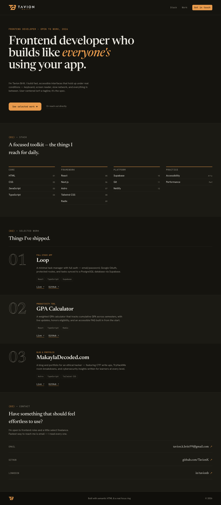
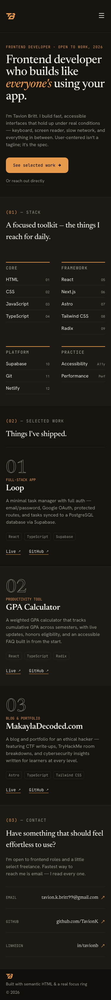

# tavionbritt.com

Personal portfolio site for Tavion Britt — a frontend developer focused on fast, accessible interfaces.

**Live site:** [tavionbritt.com](https://www.tavionbritt.com)

---

## Screenshots

### Desktop



### Mobile



---

## Stack

- [Astro](https://astro.build) — static site framework
- [Tailwind CSS v4](https://tailwindcss.com) — utility-first styling
- [TypeScript](https://www.typescriptlang.org) — type safety
- [Lucide](https://lucide.dev) — icons

## Features

- Fully accessible — keyboard navigable, screen reader tested, WCAG compliant
- Responsive layout — mobile-first design
- Sections: Hero, Tech Stack, Selected Work, Contact, Footer
- Project data driven from a single `src/data/projects.ts` file

## Project Structure

```
/
├── public/
│   ├── favicon.ico
│   └── favicon.svg
├── src/
│   ├── assets/
│   ├── components/
│   │   ├── sections/     # Hero, Stack, Work, Contact, Nav, Header, Footer
│   │   └── ui/           # Badge, Project, StackCard, StackCardItem
│   ├── data/
│   │   └── projects.ts   # Project list
│   ├── layouts/
│   │   └── Layout.astro
│   ├── pages/
│   │   └── index.astro
│   └── styles/
│       └── global.css
└── package.json
```

## Commands

| Command           | Action                                      |
| :---------------- | :------------------------------------------ |
| `npm install`     | Install dependencies                        |
| `npm run dev`     | Start local dev server at `localhost:4321`  |
| `npm run build`   | Build for production to `./dist/`           |
| `npm run preview` | Preview production build locally            |
